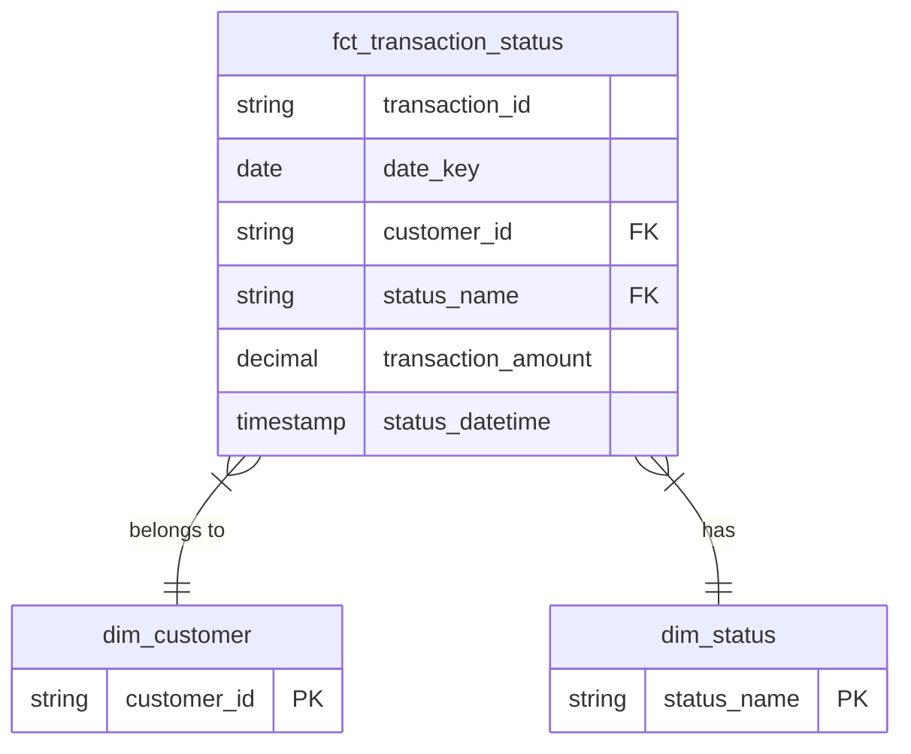

# Dojo Analytics Engineering Take-Home Interview

## Task 1: Data Modelling

Star Schema centered on transaction status events. This model is ideal for high-volume analytical queries, as it separates measurable events (facts) from their descriptive context (dimensions).

### 1.1 Fact and Dimension Tables

#### fct_transaction_status (Fact)
**Grain:** One row per transaction status change (e.g., one row for 'approved', another for 'settled' for the same transaction).

**Purpose:** Captures the complete lifecycle of a transaction, enabling analysis of status progressions and conversion funnels.

**Key Columns:** transaction_id, date_key, customer_id (FK), status_name (FK), transaction_amount, status_datetime.

#### dim_customer (Dimension)
**Grain:** One row per customer.

**Key Columns:** customer_id (PK), country_code.

#### dim_status (Dimension)
**Grain:** One row per unique, cleaned status.

**Key Columns:** status_name (PK), is_terminal_status (Boolean).

### 1.2 Schema Diagram



### 1.3 Discussion Points

My EDA uncovered several critical data quality issues that must be resolved during transformation:

**Data Quality Issues:**

- transactions has 151 rows but only 146 unique transaction_ids. Analysis reveals:
  - 1 exact duplicate (all fields identical)
  - 4 cases of transaction_id reuse (same ID, different amounts/timestamps)
  - This suggests a data integrity issue where IDs were incorrectly reused for different transactions
- transaction_status_log contains 1 exact duplicate
- status has both 'complete' and 'completed'. country has 'GBR' and 'GBRR'.
- status_datetime has 1 out-of-bounds value (year 2999).

**Potential Additional Metrics:**

The current implementation includes three core business metrics (CTO by country, system timeliness, processing efficiency). Analysis of the dataset reveals several additional metrics that could provide business value:

- **Decline Analysis:** Track decline rates
- **Time to First Approval:** Monitor approval latency from transaction creation
- **Customer Lifetime Value:** Aggregate customer behavior metrics
- **Hold Rate by Transaction Amount:** Identify patterns in fraud/risk holds
- **Conversion Funnel Metrics:** Track drop-off rates between status stages

**Optimisation:**
- **Layered Architecture:** Staging (light transformations) → Intermediate (business logic like deduplication) → Marts (dimensions, facts, metrics). Each layer has a clear purpose.
- **Read Performance:** In production, fct_transaction_status should be partitioned by date_key and clustered by customer_id and status_name for fast analytical queries.
- **Write Performance:** Incremental loading strategy recommended for production (8M daily transactions), processing only new/changed records.

**Documentation:**

- 37 schema tests for data quality (uniqueness, not null, referential integrity, accepted values)
- Model descriptions and column-level documentation in schema.yml files
- dbt docs generate for interactive lineage and documentation site

---

## Task 2: Implementation

### Project Structure
```
payment_processor_ae/
├── models/
│   ├── staging/          # Light transformations (3 views)
│   ├── intermediate/     # Business logic (1 view: deduplication)
│   └── marts/            # Analytics layer
│       ├── dimensions/   # Dimension tables (2 tables)
│       ├── facts/        # Fact table (1 table)
│       └── metrics/      # Business metrics (3 tables)
├── seeds/                # Source CSV data
├── notebooks/            # EDA
├── dbt_project.yml
├── profiles.yml.example
└── README.md
```

### Running the Project
```bash
# Setup
cp profiles.yml.example profiles.yml
uv add dbt-duckdb

# Build
uv run dbt seed
uv run dbt run
uv run dbt test

# Documentation
uv run dbt docs generate
```

### Results
- 3 seeds loaded (customers, transactions, transaction_status_log)
- 10 models built:
  - 3 staging views (light transformations only)
  - 1 intermediate view (transaction deduplication logic)
  - 2 dimension tables (customer, status)
  - 1 fact table (transaction status events)
  - 3 metric tables (CTO by country, system timeliness, processing efficiency)
- 37 data quality tests (100% passing)
- Data quality issues resolved:
  - Transaction deduplication: 151→146 records (1 exact duplicate + 4 reused IDs)
  - Status deduplication: 246→244 records (1 exact duplicate + 1 corrupt timestamp)
  - Status normalization: 'complete' standardised to 'completed'
  - Country code standardization: 'GBRR' corrected to 'GBR'
  - Invalid timestamp filtering: 1 record with year 2999 removed

### Production Considerations
Seeds are used for this exercise (small static datasets). In production with 8M daily transactions, this would use external tables or incremental loading from a data lake/warehouse.
