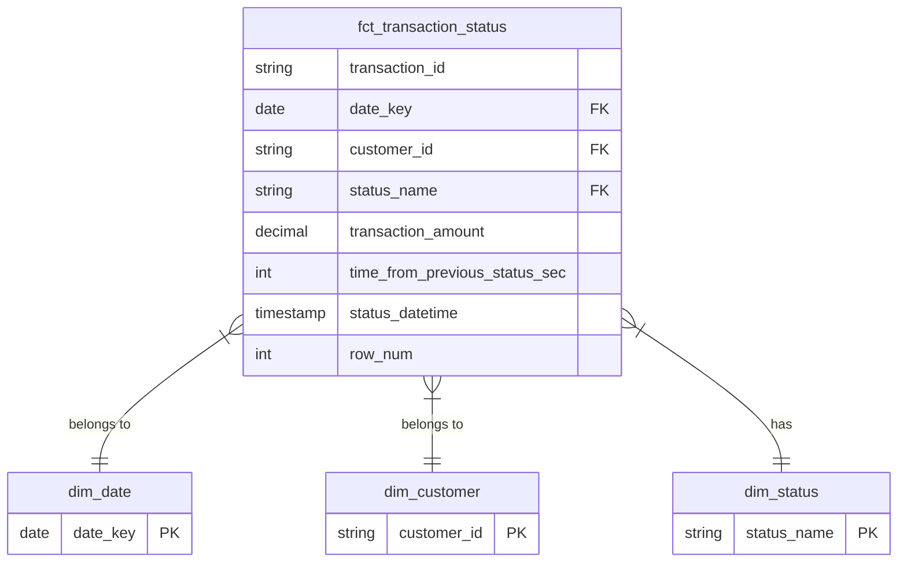

# Dojo Analytics Engineering Take-Home Interview

## Task 1: Data Modelling

Star Schema centered on transaction status events. This model is ideal for high-volume analytical queries, as it separates measurable events (facts) from their descriptive context (dimensions).

### 1.1 Fact and Dimension Tables

#### fct_transaction_status (Fact)
**Grain:** One row per transaction status change (e.g., one row for 'approved', another for 'settled' for the same transaction).

**Purpose:** Captures the complete lifecycle of a transaction, enabling analysis of time-between-steps and conversion funnels.

**Key Columns:** transaction_id, date_key (FK), customer_id (FK), status_name (FK), transaction_amount, time_from_previous_status_sec, status_datetime, row_num.

#### dim_customer (Dimension)
**Grain:** One row per customer.

**Key Columns:** customer_id (PK), country_code.

#### dim_status (Dimension)
**Grain:** One row per unique, cleaned status.

**Key Columns:** status_name (PK), is_terminal_status (Boolean).

#### dim_date (Dimension)
**Grain:** One row per day.

**Key Columns:** date_key (PK - date value), year, month, day, day_of_week, quarter.

### 1.2 Schema Diagram



### 1.3 Discussion Points

My EDA uncovered several critical data quality issues that must be resolved during transformation:

**Data Quality Issues:**

- **Duplicate Transaction Headers:** transactions has 151 rows but only 146 unique transaction_ids. This source table must be deduplicated.
- **Inconsistent Categorical Data:** status has both 'complete' and 'completed'. country has 'GBR' and 'GBRR'. These must be conformed in their respective dimension tables.
- **Corrupt Timestamps:** status_datetime has out-of-bounds values (2999-01-11). This requires error handling during type conversion.
- **Orphan Transactions:** 146 unique transactions exist, but only 84 (57.5%) have a status log. This implies over 40% of transactions are "stuck" or the log data is incomplete.

**Optimisation:**

- **Read:** The fct_transaction_status table should be partitioned by date and clustered by customer_key and status_key for fast analytical queries.
- **Write:** Data should be loaded incrementally into staging tables first, then transformed in parallel into the final dimensional model.

**Documentation:**

- Schema tests for data quality (uniqueness, not null, referential integrity)
- Model descriptions and column-level documentation in schema.yml files
- dbt docs for interactive lineage and documentation site

---

## Task 2: Implementation

### Project Structure
```
payment_processor_ae/
├── models/
│   ├── staging/          # Data cleaning (3 views)
│   └── marts/            # Business logic layer
│       ├── dimensions/   # Dimension tables (3 tables)
│       └── facts/        # Fact table (1 table)
├── seeds/                # Source CSV data
├── notebooks/            # EDA
├── dbt_project.yml
├── profiles.yml.example
└── packages.yml
```

### Running the Project
```bash
# Setup
cp profiles.yml.example profiles.yml
uv add dbt-duckdb

# Build
uv run dbt seed
uv run dbt run
uv run dbt test

# Documentation
uv run dbt docs generate
```

### Results
- 3 seeds loaded (customers, transactions, transaction_status_log)
- 7 models built (3 staging views, 4 mart tables)
- 34 data quality tests (100% passing)
- All EDA issues resolved:
  - Transaction deduplication (151→146 records)
  - Status normalization (complete→completed)
  - Country code standardization (GBRR→GBR)
  - Invalid timestamp filtering (3 records removed)

### Key Features
- Star schema with natural keys (no unnecessary surrogate keys)
- Time-between-steps calculation using LAG window function
- Terminal status classification for funnel analysis
- Complete referential integrity enforcement

### Production Considerations
Seeds are used for this exercise (small static datasets). In production with 8M daily transactions, this would use external tables or incremental loading from a data lake/warehouse.
