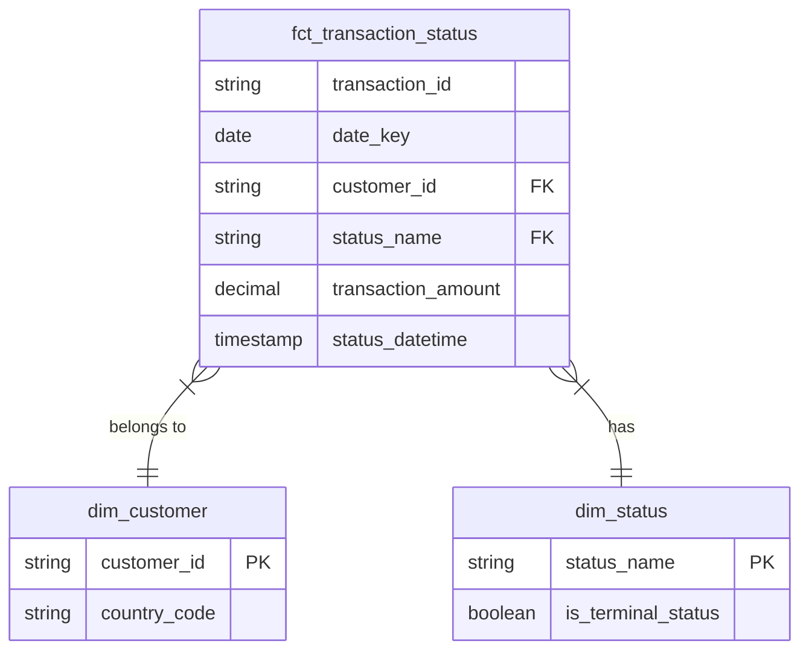

# Dojo Analytics Engineering Take-Home Interview

## Task 1: Data Modelling

Star Schema centered on transaction status events. This model is ideal for high-volume analytical queries, as it separates measurable events (facts) from their descriptive context (dimensions).

### 1.1 Fact and Dimension Tables

#### fct_transaction_status (Fact)
**Grain:** One row per transaction status change (e.g., one row for 'approved', another for 'settled' for the same transaction).

**Purpose:** Captures the complete lifecycle of a transaction, enabling analysis of status progressions and conversion funnels.

**Key Columns:** transaction_id, date_key, customer_id (FK), status_name (FK), transaction_amount, status_datetime.

#### dim_customer (Dimension)
**Grain:** One row per customer.

**Key Columns:** customer_id (PK), country_code.

#### dim_status (Dimension)
**Grain:** One row per unique, cleaned status.

**Key Columns:** status_name (PK), is_terminal_status (Boolean).

### 1.2 Schema Diagram



### 1.3 Discussion Points

My EDA uncovered several critical data quality issues that must be resolved during transformation:

**Data Quality Issues:**

- transactions has 151 rows but only 146 unique transaction_ids. Analysis reveals:
  - 1 exact duplicate (all fields identical)
  - 4 cases of transaction_id reuse (same ID, different amounts/timestamps)
- transaction_status_log contains 1 exact duplicate and 1 malformed timestamp (extra zeros)
- status has both 'complete' and 'completed'. country has 'GBR' and 'GBRR'.
- status_datetime has 1 out-of-bounds value (year 2999).

**Potential Additional Metrics:**

The current implementation includes three core business metrics (CTO by country, system timeliness, processing efficiency). Analysis of the dataset reveals several additional metrics that could provide business value:

- **Decline Analysis:** Track decline rates
- **Time to First Approval:** Monitor approval latency from transaction creation
- **Customer Lifetime Value:** Aggregate customer behavior metrics
- **Hold Rate by Transaction Amount:** Identify patterns in fraud/risk holds
- **Conversion Funnel Metrics:** Track drop-off rates between status stages

**Optimisation:**
- **Layered Architecture:** Staging (light transformations) → Intermediate (business logic like deduplication) → Marts (dimensions, facts, metrics). Each layer has a clear purpose.
- **Read Performance:** In production, fct_transaction_status should be partitioned by date_key and clustered by customer_id and status_name for fast analytical queries.
- **Write Performance:** Incremental loading strategy recommended for production (8M daily transactions), processing only new/changed records.

**Documentation:**

- 38 schema tests for data quality (uniqueness, not null, referential integrity, accepted values)
- 1 singular test for invalid timestamp detection with dynamic date boundaries
- Dynamic timestamp validation: automatically adapts yearly, configurable via `dbt vars`
- Model descriptions and column-level documentation in schema.yml files
- dbt docs generate for interactive lineage and documentation site

---

## Task 2: Implementation

### Project Structure
```
payment_processor_ae/
├── models/
│   ├── staging/          # Light transformations (3 views)
│   ├── intermediate/     # Business logic (1 view: deduplication)
│   └── marts/            # Analytics layer
│       ├── dimensions/   # Dimension tables (2 tables)
│       ├── facts/        # Fact table (1 table)
│       └── metrics/      # Business metrics (3 tables)
├── seeds/                # Source CSV data
├── notebooks/            # EDA
├── dbt_project.yml
├── profiles.yml.example
└── README.md
```

### Running the Project
```bash
# Setup
cp profiles.yml.example profiles.yml
uv add dbt-duckdb

# Build
uv run dbt seed
uv run dbt run
uv run dbt test

# Documentation
uv run dbt docs generate
```

### Results
- 3 seeds loaded (customers, transactions, transaction_status_log)
- 10 models built:
  - 3 staging views (light transformations only)
  - 1 intermediate view (transaction deduplication logic)
  - 2 dimension tables (customer, status)
  - 1 fact table (transaction status events)
  - 3 metric tables (CTO by country, system timeliness, processing efficiency)
- 38 data quality tests (100% passing)


### Production Considerations
Seeds are used for this exercise (small static datasets). In production with 8M daily transactions, this would use external tables or incremental loading from a data lake/warehouse. For orchestration, dbt Cloud provides native scheduling and monitoring, or alternatives like Dagster or Airflow can be used for more complex workflows.

---

## Task 3: Data Quality Testing

### Test Coverage

The project implements 38 dbt tests across three categories:

**1. Invalid Timestamp Values**
- `tests/assert_no_invalid_timestamps.sql` - Detects timestamps outside valid business range
- Configurable min date (default: 2020-01-01) and automatic max date (current year + 1)
- `not_null` on all `status_datetime` and `transaction_datetime` columns
- Staging layer filters invalid timestamps using dynamic boundaries

**2. Missing Values**
- `not_null` constraints on all primary keys and critical fields
- Critical fields: transaction_id, customer_id, status_name, transaction_amount, all datetime fields

**3. Duplicates**
- `unique` constraints on all primary keys and int_transactions_deduplicated.transaction_id
- Staging uses `DISTINCT` to remove exact duplicates
- Intermediate layer applies business rule for ID reuse (ROW_NUMBER keeping earliest by timestamp)

**Additional Tests:**
- Referential Integrity: 3 `relationships` tests ensuring foreign keys exist in dimension tables
- Accepted Values: 1 test ensuring status_name only contains valid statuses

### Recommended Additional Tests

**Business Logic Tests:**
1. Transaction Amount Validation: Ensure amounts are positive and within reasonable bounds

2. Status Progression Rules Detect invalid status transitions (e.g., completed before approved). Terminal statuses (completed, cancelled, failed, declined) should not have subsequent status changes

3. Temporal Consistency: Ensure status_datetime is after transaction_datetime

**Data Freshness Tests**:
- Ensure transaction_datetime is within last 30 days
- Alert if no new data loaded in last 24 hours

### Monitoring Data Quality Over Time

**Test Execution:**
- Run tests on every commit (CI/CD): `dbt test`
- Monitor key metrics: test failure rates, record count deltas, data freshness

**Observability Tools:**
- dbt Cloud: Built-in test history and scheduling
- Dagster/Airflow: Orchestration with data quality gates and alerting
- Elementary: Open-source dbt observability (anomaly detection, lineage)

**Alerting Strategy:**
- Fail pipeline on critical test failures (referential integrity, null PKs)
- Alert on volume anomalies (>5% record count change)
- Track test execution trends via dbt artifacts (`target/run_results.json`)

### Key Edge Cases

**1. Late-Arriving Data**
- Status updates arriving out of order
- **Mitigation:** Use processing_timestamp vs event_timestamp for deduplication ordering

**2. Idempotency**
- Re-running same data should produce identical results
- **Mitigation:** Add tiebreaker column (e.g., ingestion_id) to ROW_NUMBER for deterministic deduplication

**3. Schema Evolution**
- New status types (e.g., 'refunded') would break accepted_values test
- **Mitigation:** Maintain allowed_values in config file, not hardcoded in schema.yml

**4. Regulatory Compliance**
- GDPR right-to-delete, PCI-DSS data retention
- **Mitigation:** Soft deletes, audit logging, automated data retention policies
